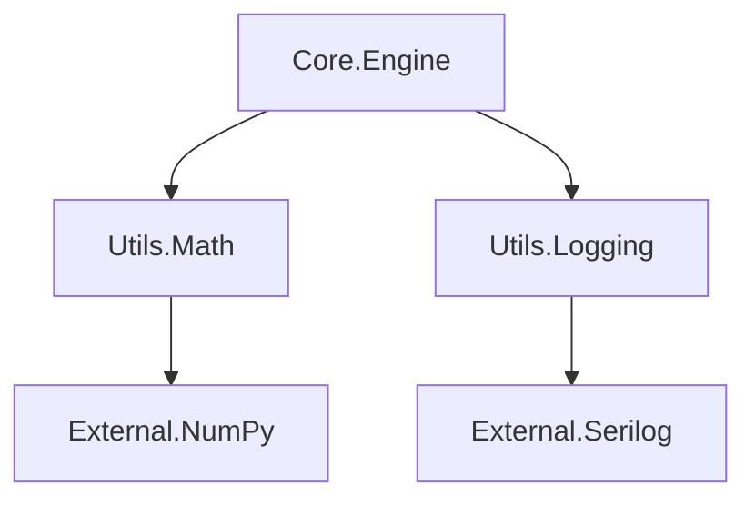

# SKILL-012: Dependency Tree Mapping

## Overview

Executes "Structural Awareness" by building a map of how different parts of the project rely on each other. It uses language-specific tools (nuget, pip, npm, cargo) to extract the graph and visualize it.

## Trigger Phrases

- `map dependencies`
- `show dependency tree`
- `check impact of <library>`
- `find point of failure`

## Inputs

| Parameter | Type | Required | Default | Description |
|-----------|------|----------|---------|-------------|
| `--workspace-path` | string | No | Current directory | Root of the project |
| `--depth` | int | No | 3 | Depth of dependency recursion |
| `--format` | string | No | `mermaid` | Output format: `mermaid`, `json`, `text` |

## Outputs

### 1. DEPENDENCY_GRAPH.mmd (Mermaid)

Visual graph ready for rendering:

### 2. RISK_REPORT.md

Analysis of the graph:
- **Critical Nodes:** Libraries that >50% of the project depends on.
- **Cycle Detection:** Circular dependencies that might cause build failures.
- **Version Conflicts:** Multiple versions of the same library requested.

## Preconditions

1. Build files must exist (package.json, *.csproj, pyproject.toml).
2. Dependencies must be resolvable (e.g., `npm list` works).

## Implementation

### Script: map_dependencies.ps1

1. **Detects Tech Stack:** (Uses `WORKSPACE_PROFILE.json` if available).
2. **Extracts Graph:**
   - **Node.js**: `npm list --json`
   - **.NET**: `dotnet list package --include-transitive` (parsed)
   - **Python**: `pipdeptree --json` (if installed)
3. **Generates Mermaid:** Transforms raw data into Mermaid syntax.
4. **Analyzes Risk:** Calculates centrality of nodes to identify critical points.

## Use Cases

1. **QA Auditing:** Identifying "single-points-of-failure" where a single library version mismatch could crash the system.
2. **Refactoring:** Knowing that changing "AuthService" impacts "UserDashboard", "AdminPanel", and "ReportingJob".
